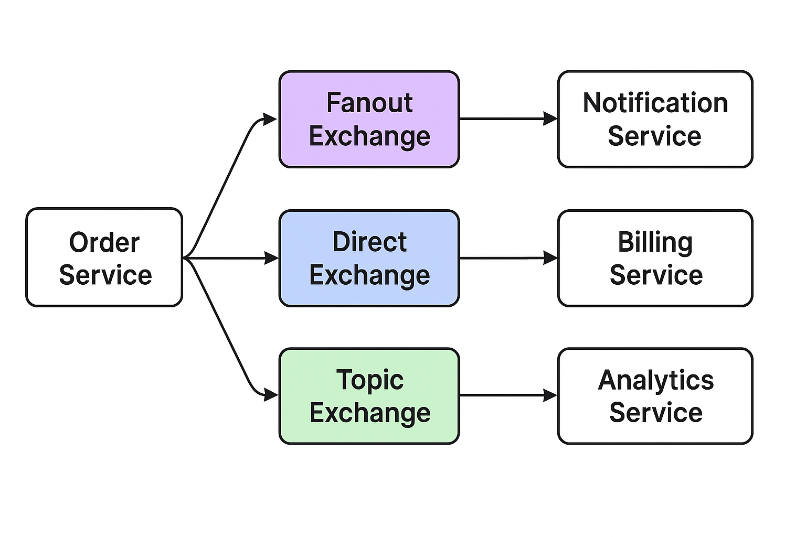

# This is a demo of RabbitMQ

### 🔹 Common Design for Publisher → Consumer with RabbitMQ

In **microservices architecture**, a common design is:

1. **Publisher Service (e.g., Order Service)**

    * Does not know about consumers.
    * Only publishes messages to an **Exchange** (Topic, Fanout, Direct, Headers).
    * Keeps exchange definitions (sometimes just exchange names, queues are not needed here).

2. **RabbitMQ (Message Broker)**

    * Routes messages from exchanges → queues based on routing rules.
    * Handles fanout, filtering, routing, and durability.

3. **Consumer Services (e.g., Notification, Billing, Analytics, Shipping)**

    * Define their own **queue** and **bindings** to the exchange(s).
    * This allows each consumer to control what messages it receives.
    * Multiple consumers can bind to the same exchange differently.

👉 **Key principle**:
**Publisher only knows about exchanges. Consumers own their queues.**
This keeps services decoupled.
